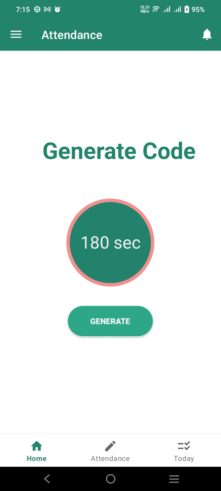
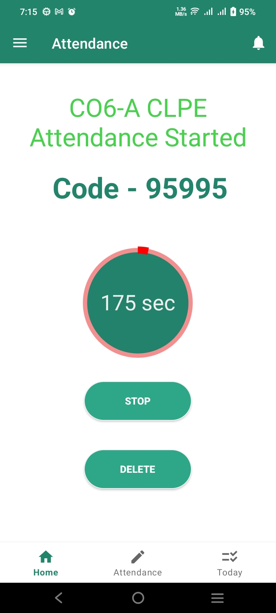
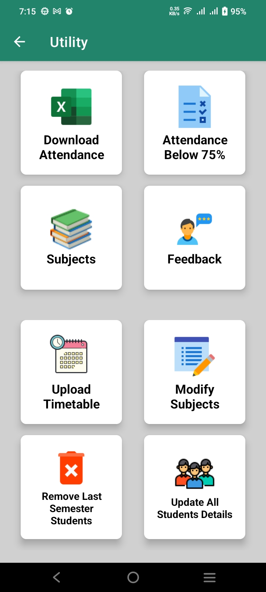

# 👩‍🏫 **ClassSync Teacher App**

**ClassSync Teacher App** is an intuitive Android application designed to empower teachers with tools to efficiently manage class attendance, track submissions, and monitor student performance.  

---

## ✨ **Features**

- 📋 **Attendance Management**  
  - Mark student attendance quickly and effortlessly.  
  - Download attendance records in **Excel format** for easy record-keeping.

- 📊 **Marks and Submission Tracking**  
  - Manage and view student marks for tests and assignments.  
  - Track submission status of assignments for each student.

- 🛠️ **Utility Features**  
  - Get real-time updates synced with Firebase.  
  - Simple and user-friendly interface tailored for teachers.  

---

## 🚀 **Tech Stack**

- **Programming Language**: Java ☕  
- **Backend**: Firebase 🔥 (Authentication, Realtime Database, Cloud Functions)  
- **Tools**: Android Studio 🛠️  

---

## 📱 **Screenshots**  

<p align="center">
  
  
  
</p>

---

## 🛠️ **How to Install**

Follow these steps to set up and run the ClassSync Teacher App on your local machine:

1. **Clone this repository**:  
   Open your terminal and run:  
   ```bash
   git clone https://github.com/yourusername/ClassSync-Teacher-App.git
2. **Open the project**:
   Open the cloned project in **Android Studio**.
3. **Set up Firebase**:
   - Go to Firebase Console and create a new project.
   - Download the `google-services.json` file from Firebase and place it in the `app/` directory.
4. **Build and run the project**:
   - Connect your Android device or start an emulator.
   - Click the Run button in Android Studio to install and launch the app.

## 🤝 **Contributing**
I welcome contributions to enhance the functionality of the ClassSync Teacher App! Here's how you can contribute:

1. **Fork the Repository**:
Click the "Fork" button on the top right of this repository to create a copy under your GitHub account.
2. **Clone Your Fork**:
Clone your fork to your local system:
   ```
   git clone https://github.com/yourusername/ClassSync-Teacher-App.git
   cd ClassSync-Teacher-App
   ```
3. **Create a Branch**:
   Create a branch for your feature or bug fix:
   ```
   git checkout -b feature-or-bugfix-name
   ```
4. **Make Your Changes**:
Implement the changes or add features as needed.
5. **Commit and Push**:
Save your changes and push them to your fork:
```
git add .
git commit -m "Description of your changes"
git push origin feature-or-bugfix-name
```
6. **Submit a Pull Request**:
Go to the original repository on GitHub, and click **Pull Request**. Fill in the template and submit your changes for review.
